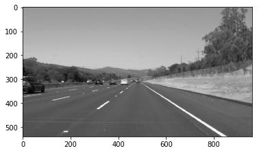
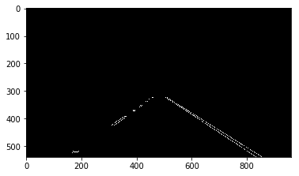
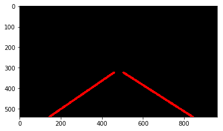
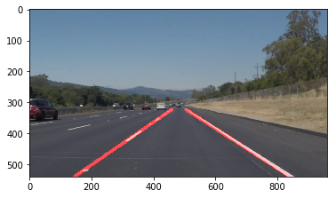

# **Finding Lane Lines on the Road** 

The goal of this project is to build an image processing pipeline that finds lane lines on the road. This document describes various steps used in the pipeline and the approach used.

## Design
To find lane lines various image pre-processing and transformations like grayscale conversion, edge detection, etc. are applied. Images in "test_images" folder are used to train/tweak parameters in the pipeline. Processed images are stored in "test_images_output" folder. Once pipeline is working fine for test images, it is used for detecting lines in the videos in "test_videos" folder. Processed videos are stored in "test_videos_output" folder.

Following section describes each step of the pipeline in detail:

**Step 1: Convert to Grayscale**
Since road is black/darker in shade than the lane lines, white and yellow lines show high contrast. So, by converting image to grayscale, white and yellow lines stand out easily with high contrast. Following image shows input image converted to grayscale:

**Step 2: Apply Gaussian Blur**
Next, Gaussian Blur is applied to reduce noise in image. This helps to reduce number small and insignificant edges in the image. But while applying blur, we need to make sure not to blur too much, otherwise it will become difficult to find an edge. Below image shows output after gaussian blur is applied:

**Step 3: Detect Edges**
After image is pre-processed using grayscale and gaussian blur, it can be used to detect edges by applying Canny Edge Detection. This takes two inputs - low threshold and high threshold. Points with gradient value higher than high threshold are considered as part of an edge and points in between low and high are considered only if they are next to already detected edge. Output of this step is bunch of points that are part of detected edges as shown below:

**Step 4: Find out Region of Interest**
Canny edge detection gives edges in entire image. We need to consider edges related to only lane lines and ignore rest. Since the camera is mounted at a fixed location for all images/frames, we can approximate which part of image can contain lane lines. So, after masking irrelevant part of image we get edges in the area where lane line may present as follow:

**Step 5: Apply Hough Transform**
Next, we apply hough transform on the masked image with edges. Hough transform combines all points that lie on a line and returns end-points of all line segments.

**Step 6: Find out Lane Lines**
Once we have list of all line segments, we need to separate line segments that are part of left lane and right lane and discard other lines. This is done in "`draw_lines()`" function by calculating slope of every line. Lines with negative slope are left lines and lines with positive slope are right lines. But at the same time, we need to remember that all the lines with negative slope are not part of left lane, and so for right lines. So, based on the slope values in lane line range, lines are classified as left lane lines and right lane lines, rest of the lines are discarded. 
After separating left lane lines and right lane lines, average slope for both left and right lane lines is calculated. These two slope values are used to extrapolate actual lane lines. Since video is sequence of images, we consider lane lines calculated for past few frames to smoothen lines in current frame. Following image shows extrapolated lane lines constructed using relevant line segments:

**Step 7: Annotate Input Frame/Image**
In the last step, we merge extrapolated lines with the original image to get a frame/image with marked lane lines as shown below:

## Limitations/Shortcomings
As edges are detected by calculating gradients, detecting lane lines on a cement road becomes difficult with the threshold values used in current implementation. If those threshold values are changed to accommodate this situation, output of canny edge becomes noisier. This can be seen in "challenge video". Another limitation is that current pipeline is not useful to find and draw lane lines on a curve.

## Further Improvements
For improving this pipeline further, we can use better image pre-processing techniques and neural networks.
